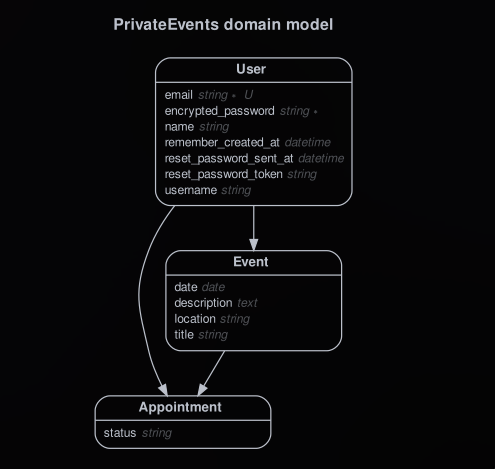

# Private Events

> Collaborative project. We dive into ActiveRecord's association and created an
even-brite kind of application called 'Private Events'

The objective was to gain a better understanding of Rails Associations:
belongs_to, has_one, has_many, etc.

The app allows signed users to create events, invite other users and accept
invitations.

## Built With

- Ruby on Rails v6.0.3.1
- Devise Gem
- Bootstrap

## Authors

👤 **Julio Añoveros**

- Github: [@jubaan](https://github.com/jubaan)
- Twitter: [@AnoverosJulio](https://twitter.com/AnoverosJulio)
- Linkedin: [linkedin](https://www.linkedin.com/in/julio-a%C3%B1overos-b987a8a/)

👤Felipe dos Anjos

- Github: [@githubhandle](https://github.com/fc-anjos)
- Linkedin: [linkedin](https://linkedin.com/in/fc-anjos)

Give a ⭐️ if you like this project!

